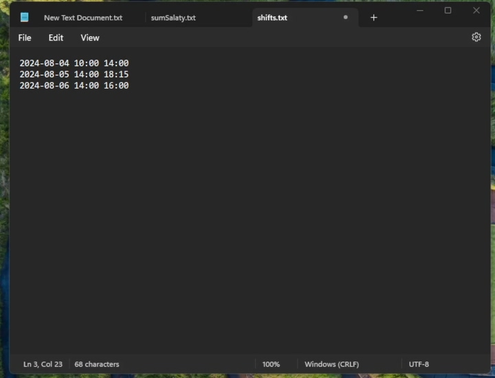
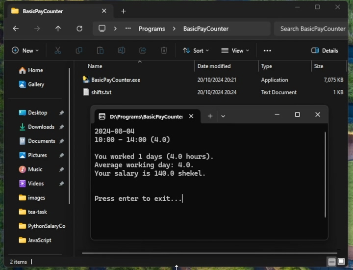

# BasicPayCounter
BasicPayCounter is a basic Python application designed to calculate wages based on hours worked and hourly rate. It offers a straightforward approach to payroll calculation by multiplying the number of hours worked by the hourly pay rate.

# How to Use BasicPayCounter
1. Download the release and place the BasicPayCounter.exe file in a separate folder.

2. Create a text document where you will write all your work shifts in this format: 
`YYYY-MM-DD HH:MM HH:MM` 
Example: `2024-08-04 10:00 14:00` 
The first time is the start of your shift, and the second time is the end of your shift.
 
You can write more than one shift in the file. Each shift should be on a new line.

3. Take the text file and open it with BasicPayCounter.exe.

4. That’s it! The command line will display all your shift information.

